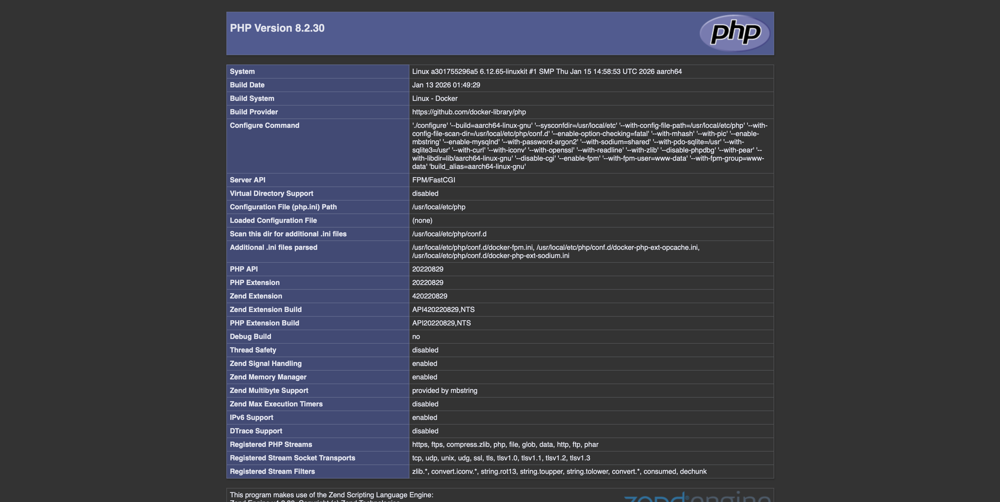

# Лабораторная работа №2: Nginx + PHP-FPM

## 👩‍💻 Автор
ФИО: Лямичев Семён Яковлевич  
Группа: ПМИ2-ИП1

---

## 📌 Описание задания
1. Научиться конфигурировать веб-сервер Nginx для работы с PHP через PHP-FPM.
2. Освоить базовые принципы PHP (на примере phpinfo()).
3. Повторить основы HTML: работа с формами, различными типами полей ввода.
4. Освоить базовую обработку форм с помощью JavaScript без перезагрузки страницы.

Результат доступен по адресу [http://localhost:8080](http://localhost:8080).

---

## ⚙️ Как запустить проект

1. Клонировать репозиторий:
   ```bash
   git clone <ссылка на репозиторий>
   cd php-fpm-lab
Запустить контейнеры:
```bash
docker-compose up -d --build
```
Открыть в браузере:
```http://localhost:8080```
📂 Содержимое проекта

```docker-compose.yml``` — описание сервиса Nginx

```www/index.html``` — главная HTML-страница

```screenshots/``` — скриншот для шага 3

📸 Скриншоты работы


✅ Результат
Сервер в Docker успешно запущен, Nginx отдаёт мою HTML-страницу с тестовой формой покупки билетов в кино